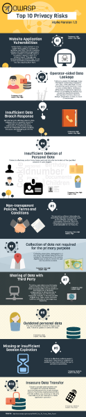

---

layout: col-sidebar
title: OWASP Top 10 Privacy Risks
tags: example-tag
level: 3
type: documentation

---
<b>:sparkles: :tada: Version 2.0 has been released :sweat_smile: :sparkles:</b>

The OWASP Top 10 Privacy Risks Project provides a top 10 list for privacy risks in web applications and related countermeasures. It covers technological and organizational aspects that focus on real-life risks, not just legal issues. The Project provides tips on how to implement privacy by design in web applications with the aim of helping developers and web application providers to better understand and improve privacy. The list uses the OECD Privacy Guidelines as a framework and can also be used to assess privacy risks associated with specific web applications.

<h2>Top 10 Privacy Risks</h2>
The following table shows version 2.0 of the OWASP Top 10 Privacy Risks and compares it to the ranking of 2014.
<!--

-->
<pre><code>
 2021  2014  Title 
 P1    1     Web Application Vulnerabilities 
 P2    2     Operator-sided Data Leakage 
 P3    3     Insufficient Data Breach Response 
 P4    New   Consent on Everything 
 P5    5     Non-transparent Policies, Terms and Conditions 
 P6    4     Insufficient Deletion of User Data 
 P7    New   Insufficient Data Quality 
 P8    9     Missing or Insufficient Session Expiration 
 P9    13    Inability of users to access and modify data 
 P10   6     Collection of data not required for the user-consented purpose
</code></pre>
Detailed information is provided in the Top 10 Privacy Risks tab.

<h2 id="quick_download">Quick Download</h2>
Important note: The following downloads show results and countermeasures for version 1.0 from 2014. Downloads for version 2.0 will be provided soon. 
<ul>
<li><a href="/www-pdf-archive/OWASP_Top_10_Privacy_Countermeasures_v1.0.pdf">Top 10 Privacy Risks Countermeasures v1.0 (PDF)</a></li>
<li><a href="OWASP_Top10PrivacyRisks_20150529.pptx">Top 10 Privacy Risks Presentation (PPTX)</a></li>
<li><a href="/www-pdf-archive/OWASPTop10PrivacyRisks_20141209.pdf">Results presentation at German OWASP Day 2014</a></li>
<li><a href="/www-pdf-archive/Top10PrivacyRisks_IAPP_Summit_2015.pdf">Presentation from IAPP Global Privacy Summit 2015</a></li>
<li><a href="/www-pdf-archive/Presentation_HowToBoostPrivacy_IAPP_Intensive_2016.pdf">Presentation of countermeasures from IAPP Data Protection Intensive 2016</a></li>
</ul>
  
<h2 id="licensing">Licensing</h2>

OWASP Top 10 Privacy Risks Project is free to use. It is licensed under the Creative Commons CC-BY-SA v3.0 License.

